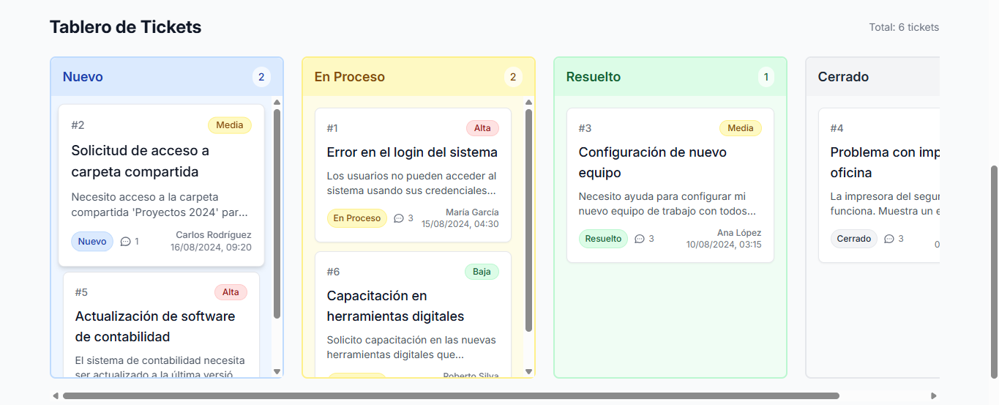
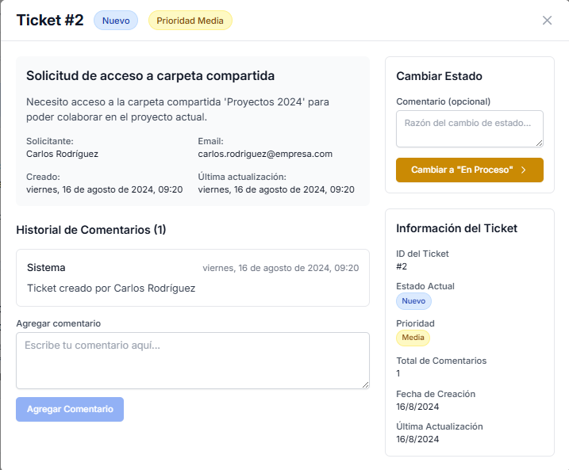
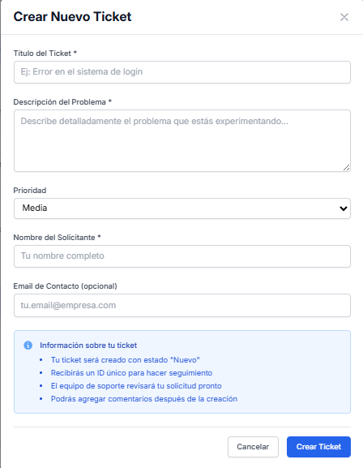

# 🎫 Sistema de Tickets de Soporte

> **Prueba Técnica** - Sistema web completo para gestión de tickets de soporte con Django + React

[](https://python.org)
[](https://djangoproject.com)
[](https://reactjs.org)
[](https://tailwindcss.com)

## 🚀 **Demo en Vivo**

- **Frontend**: [Ver aplicación](https://tu-usuario.github.io/repo-name)

## 📸 **Capturas de Pantalla**

### Vista Tablero Kanban


### Detalle de Ticket


### Formulario Crear Ticket


## ✨ **Características Principales**

- 🎯 **Flujo de Estados Controlado**: `nuevo → en_proceso → resuelto → cerrado`
- 💬 **Sistema de Comentarios**: Historial cronológico completo
- 🔍 **Filtros Avanzados**: Búsqueda por texto y estado en tiempo real
- 📊 **Vista Kanban**: Tablero visual intuitivo por columnas
- 🎨 **UI/UX Moderna**: Responsive design con Tailwind CSS
- ⚡ **API REST Completa**: Django REST Framework
- ✅ **Validaciones**: Frontend y backend con manejo de errores
- 📱 **Responsive**: Funciona en desktop, tablet y móvil

## 🛠️ **Tecnologías Utilizadas**

### Backend
- **Django 4.2** - Framework web de Python
- **Django REST Framework** - API REST
- **SQLite** - Base de datos (fácil desarrollo)
- **CORS Headers** - Configuración CORS

### Frontend
- **React 18** - Biblioteca de UI
- **Vite** - Build tool rápido
- **Tailwind CSS** - Framework CSS utility-first
- **Axios** - Cliente HTTP
- **Context API** - Gestión de estado global

## 🚀 **Instalación y Configuración**

### Requisitos Previos
- Python 3.8 o superior
- Node.js 16 o superior
- npm o yarn

### 1. Clonar el Repositorio
```bash
git clone https://github.com/tu-usuario/sistema-tickets-soporte.git
cd sistema-tickets-soporte
```

### 2. Configurar Backend (Django)
```bash
cd backend

# Crear entorno virtual
python -m venv venv

# Activar entorno virtual
# Windows:
venv\Scripts\activate
# macOS/Linux:
source venv/bin/activate

# Instalar dependencias
pip install -r requirements.txt

# Configurar base de datos
python manage.py makemigrations
python manage.py migrate

# Cargar datos de ejemplo
python manage.py loaddata fixtures/sample_data.json

# Crear superusuario (opcional)
python manage.py createsuperuser

# Ejecutar servidor
python manage.py runserver
```

### 3. Configurar Frontend (React)
```bash
# En nueva terminal
cd frontend

# Instalar dependencias
npm install

# Ejecutar servidor de desarrollo
npm run dev
```

### 4. Acceder a la Aplicación
- **Frontend**: http://localhost:5173
- **API**: http://localhost:8000/api
- **Admin Django**: http://localhost:8000/admin

## 📁 **Estructura del Proyecto**

```
sistema-tickets-soporte/
├── backend/
│   ├── tickets_system/          # Configuración Django
│   ├── tickets/                 # App principal
│   │   ├── models.py           # Modelos Ticket y Comment
│   │   ├── serializers.py      # Serializers DRF
│   │   ├── views.py            # ViewSets y API views
│   │   ├── urls.py             # URLs de la API
│   │   └── admin.py            # Configuración admin
│   ├── fixtures/               # Datos de ejemplo
│   └── requirements.txt        # Dependencias Python
├── frontend/
│   ├── src/
│   │   ├── components/         # Componentes React
│   │   ├── context/            # Context API
│   │   ├── services/           # Cliente API
│   │   └── App.jsx             # Componente principal
│   ├── package.json            # Dependencias Node.js
│   └── tailwind.config.js      # Configuración Tailwind
├── docs/                       # Documentación y mockups
└── README.md                   # Este archivo
```

## 🔄 **Flujo de Estados**

```
┌─────────┐    ┌──────────────┐    ┌──────────┐    ┌─────────┐
│  NUEVO  │───▶│  EN PROCESO  │───▶│ RESUELTO │───▶│ CERRADO │
│   🔵    │    │     🟡       │    │    🟢    │    │   ⚫    │
└─────────┘    └──────────────┘    └──────────┘    └─────────┘
     ▲                │
     │                │
     └────────────────┘
       (retrabajo)
```

### Transiciones Válidas:
- `nuevo` → `en_proceso`: Iniciar trabajo
- `en_proceso` → `resuelto`: Completar solución  
- `en_proceso` → `nuevo`: Retrabajo necesario
- `resuelto` → `cerrado`: Confirmación final

## 🧪 **Pruebas y Validación**

### Datos de Ejemplo
El sistema incluye 6 tickets de prueba con:
- Diferentes estados y prioridades
- Comentarios de ejemplo
- Historial de transiciones

### APIs Disponibles
```bash
# Listar tickets
GET /api/tickets/

# Crear ticket
POST /api/tickets/

# Obtener ticket específico
GET /api/tickets/{id}/

# Cambiar estado
PATCH /api/tickets/{id}/transition/

# Gestionar comentarios
GET/POST /api/tickets/{id}/comments/

# Estadísticas
GET /api/tickets/stats/
```

### Validaciones Implementadas
- ✅ Transiciones de estado según flujo definido
- ✅ Campos obligatorios en formularios
- ✅ Validación de formato de email
- ✅ Longitud mínima en textos
- ✅ Manejo de errores HTTP apropiados

## 🎨 **Características de Diseño**

- **Paleta de Colores**: Estados identificables visualmente
- **Iconografía**: Iconos intuitivos para cada acción
- **Feedback Visual**: Loading states, confirmaciones, errores
- **Accesibilidad**: Contraste adecuado, navegación por teclado
- **Animaciones**: Transiciones suaves y micro-interacciones

## 🚦 **Estados de Tickets**

| Estado | Color | Descripción |
|--------|-------|-------------|
| 🔵 Nuevo | Azul | Tickets recién creados |
| 🟡 En Proceso | Amarillo | Tickets siendo trabajados |
| 🟢 Resuelto | Verde | Tickets solucionados |
| ⚫ Cerrado | Gris | Tickets finalizados |

## 🎯 **Decisiones Técnicas**

### Backend
- **Django**: Framework robusto y escalable
- **DRF**: APIs REST estándar con serialización
- **SQLite**: Base de datos simple para desarrollo
- **Validaciones**: Lógica de negocio en modelos

### Frontend  
- **React**: Componentización y reutilización
- **Context API**: Estado global sin dependencias extras
- **Tailwind**: CSS utility-first para rapidez
- **Vite**: Build tool moderno y rápido

## 📈 **Posibles Mejoras Futuras**

- [ ] Autenticación y autorización de usuarios
- [ ] Asignación de tickets a agentes específicos
- [ ] Notificaciones en tiempo real (WebSockets)
- [ ] Métricas y dashboard de reportes
- [ ] Integración con sistemas externos
- [ ] API para adjuntos de archivos
- [ ] SLA y tiempo de respuesta automático
- [ ] Tests automatizados (pytest, Jest)

## 🤝 **Contribución**

Este proyecto fue desarrollado como prueba técnica. Las sugerencias y mejoras son bienvenidas:

1. Fork el proyecto
2. Crea una rama para tu feature (`git checkout -b feature/nueva-caracteristica`)
3. Commit tus cambios (`git commit -m 'Agregar nueva característica'`)
4. Push a la rama (`git push origin feature/nueva-caracteristica`)
5. Abre un Pull Request

## 📄 **Licencia**

Este proyecto es de código abierto bajo la licencia MIT. Ver archivo [LICENSE](LICENSE) para más detalles.

## 👨‍💻 **Autor**

**Tu Nombre**
- GitHub: [@tu-usuario](https://github.com/johnja1989)
- LinkedIn: [Tu LinkedIn](https://www.linkedin.com/in/john-jairo-vargas-gonz%C3%A1lez-25a790237/)
- Email: johnjairovargasgonzalez@gmail.com

---

⭐ **¡Si te gusta este proyecto, dale una estrella!** ⭐